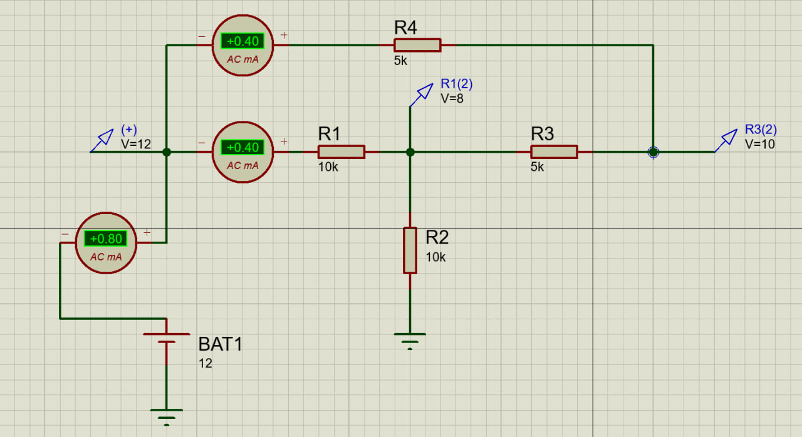
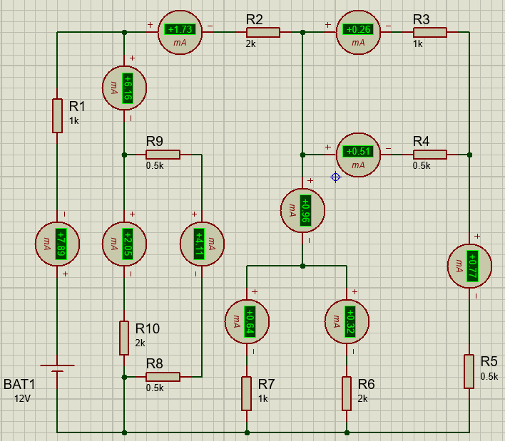

## Задача 2. Универсальный симулятор резистивных цепей постоянного тока

### Входные данные:

Файл с описанием цепи. Формат файла следующий:

- Каждая строка файла описывает один элемент – либо резистор, либо источник напряжения.
- Формат строки для описания резистора:

```text
R:<R_name> <node1> <node2> R=<Resistance>
```
где R_name – имя резистора (строка), node1 – имя первого узла (строка), node2 – имя второго узла (строка), Resistance – сопротивление в Омах (число).

- Формат строки для описания источника напряжения:

```text
Vsrc:<Vsrc_name> <node1> <node2> U=<Voltage>
```
где `Vsrc_name` – имя источника тока (строка), `node1` – имя положительного узла (строка), `node2` – имя отрицательного узла (строка), `Voltage` – напряжение в Вольтах (число).

- Узел земли называется `gnd`.

### Результат работы программы:

Файл с напряжением в узлах. Формат файла следующий:
- Каждая строка описывает потенциал одного узла.
- Формат строки для описания потенциала одного узла:

```text
<nodeA> <Voltage>
```
где `nodeA` – имя узла (строка), `Voltage` – потенциал узла.

Проверка корректности работы программы будет проводиться на примерах нескольких больших резистивных цепей (в том числе и на тех, которые были представлены в первом задании).

### Подсказки

1. Для решения задачи необходимо использовать модифицированный метод узловых потенциалов (`Modified Nodal Analysis`). Ссылки:
    - [SpiceSharp](https://spicesharp.github.io/SpiceSharp/articles/custom_components/modified_nodal_analysis.html)
    - [IEEE Xplore](https://ieeexplore.ieee.org/abstract/document/1084079)
2. Программу следует разбить на несколько частей:
    1. Парсер (чтение входного файла).
    2. Построитель матрицы и правой части.
    3. Решатель линейной системы (можно использовать уже готовый).
    4. Пост-процессор (запись результата в файл).
3. Узел земли `gnd` необходимо исключить из решения линейной системы.


## Результат выполнения работы программы

### Пример задачи №1




```text
--------------------------------------------------
Потенциалы в узлах:
n1: 12.0 V
n2: 8.0 V
n3: 10.0 V
--------------------------------------------------
Сила токи через резисторы:
R1: 0.400 A
R2: 0.800 A
R3: -0.400 A
R4: 0.400 A
--------------------------------------------------
``` 


```text
--------------------------------------------------
Потенциалы в узлах:
n1: 12.0 V
n2: 7.5 V
n3: 9.8 V
--------------------------------------------------
Сила токи через резисторы:
R1: 0.300 A
R2: 0.750 A
R3: -0.450 A
R4: 0.450 A
--------------------------------------------------
``` 


### Пример задачи №2




```text
--------------------------------------------------
Потенциалы в узлах:
n1: 29.2 V
n2: 17.2 V
n5: 27.4 V
n10: 28.1 V
n6: 27.4 V
n9: 29.2 V
n7: 27.4 V
n8: 29.2 V
n3: 17.2 V
n4: 29.2 V
--------------------------------------------------
Сила токи через резисторы:
R1: 12.000 A
R2: -5.063 A
R3: -0.750 A
R4: -1.500 A
R5: -2.249 A
R6: -0.937 A
R7: -1.875 A
R8: -24.000 A
R9: -24.000 A
R10: -6.000 A
--------------------------------------------------
``` 


### Результат автоматического тестирования - `unittest`

```text
Testing started at 17:11 ...
Launching pytest with arguments /home/redalexdad/GitHub/HwTasksBmstu/test.py --no-header --no-summary -q in /home/redalexdad/GitHub/HwTasksBmstu

============================= test session starts ==============================
collecting ... collected 2 items

test.py::TestResistorCircuitSimulator::test_1 PASSED                     [ 50%]--------------------------------------------------
Потенциалы в узлах:
n1: 12.0 V
n2: 8.0 V
n3: 10.0 V
--------------------------------------------------
Сила токи через резисторы:
R1: 0.400 A
R2: 0.800 A
R3: -0.400 A
R4: 0.400 A
--------------------------------------------------

test.py::TestResistorCircuitSimulator::test_2 PASSED                     [100%]--------------------------------------------------
Потенциалы в узлах:
n1: 12.0 V
n2: 7.5 V
n3: 9.8 V
--------------------------------------------------
Сила токи через резисторы:
R1: 0.300 A
R2: 0.750 A
R3: -0.450 A
R4: 0.450 A
--------------------------------------------------


============================== 2 passed in 0.01s ===============================

Process finished with exit code 0
```