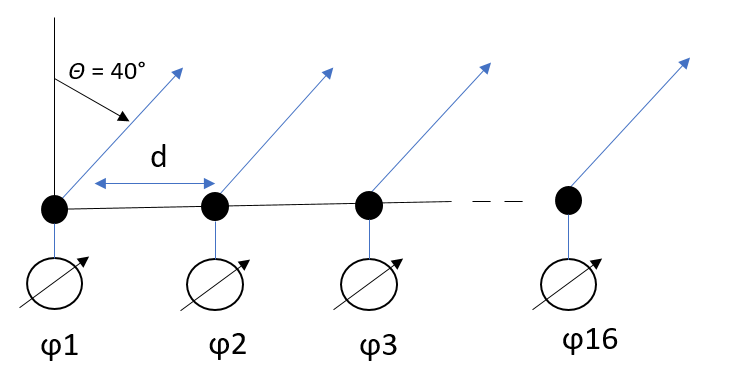

### Задачи по расчету антенных решеток

1. Найдите фазовый сдвиг для 4-го элемента линейной антенной решетки 16x1, чтобы направление главного луча было равно 45 градусам. (Центральная частота равна 6 ГГц, расстояние между элементами равно половине длины волны, все элементы изотропны).

  

Решение:

### Шаг 1: Определение длины волны

Центральная частота $f = 6 \text{ ГГц}$.

Длина волны $\lambda$ рассчитывается по формуле:

$$
\lambda = \frac{c}{f}
$$

где $c$ — скорость света (приблизительно $3 \times 10^8 \text{ м/с}$).

Таким образом:

$$
\lambda = \frac{3 \times 10^8 \text{ м/с}}{6 \times 10^9 \text{ Гц}} = 0.05 \text{ м}
$$

### Шаг 2: Определение расстояния между элементами антенны

Расстояние $d$ между элементами равно половине длины волны:

$$
d = \frac{\lambda}{2} = \frac{0.05 \text{ м}}{2} = 0.025 \text{ м}
$$

### Шаг 3: Нахождение фазового сдвига для угла 45 градусов

Основное направление луча задается углом $\Theta = 45^\circ$.

Фазовый сдвиг $\Delta\phi$ между элементами для заданного угла рассчитывается по формуле:

$$
\Delta\phi = -\frac{2\pi d}{\lambda} \sin\Theta
$$

Подставим значения $d$, $\lambda$ и $\Theta$:

$$
\Delta\phi = -\frac{2\pi \times 0.025}{0.05} \sin(45^\circ) = -\frac{\pi}{1} \cdot \frac{\sqrt{2}}{2} = -\frac{\pi \sqrt{2}}{2}
$$

### Шаг 4: Расчет фазового сдвига для 4-го элемента

Фазовый сдвиг для $n$-го элемента:

$$
\phi_n = (n-1) \Delta\phi
$$

Для 4-го элемента ($n = 4$):

$$
\phi_4 = (4-1) \cdot -\frac{\pi \sqrt{2}}{2} = 3 \cdot -\frac{\pi \sqrt{2}}{2} = -\frac{3\pi \sqrt{2}}{2}
$$

Таким образом, фазовый сдвиг для 4-го элемента антеннной решетки составляет:

$$
-\frac{3\pi \sqrt{2}}{2} \text{ радиан}
$$

2. Комплексные входные значения для линейной 6-элементной антенной решетки
следующие:
   3. [1+0j, -1+0j, 1+0j, -1+0j,1+0j,-1+0j]
   4. [1+0j, 0+1j, -1+0j, 0+-1j,1+0j,0+1j]
   5. [1+0j, -0.61+0.8j, -0.27-0.96j, 0.93+0.37j,-0.86+0.51j,0.11-0.99j]

      3. Каково основное направление луча данной антенной решетки? (Все элементы изотропны и идеальны)
      4. Напишите программу на Python для построения нормализованной диаграммы направленности.

