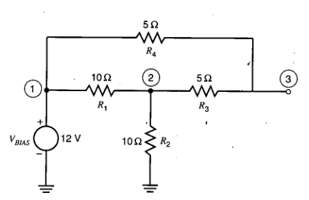
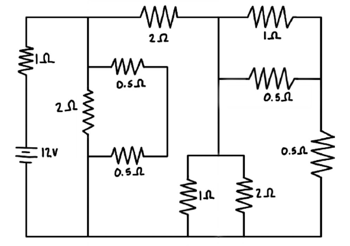
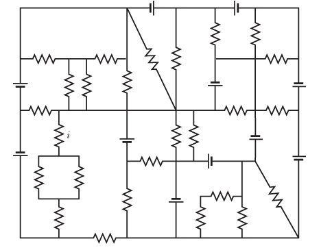

### Задачи по расчету электрических цепей

1.	Вычислить напряжение в узлах 1, 2 и 3, а также ток, текущий через источник 
напряжения $V_{BIAS}$, для цепи, представленной на схеме ниже.

<p align="center">
  
</p>

Решение:

Шаг 1: Определение эквивалентного сопротивления

$R_{34} = R_3 + R_4 = 5 + 5 = 10 \ Ом$

Шаг 2: Определение эквивалентного сопротивления для параллельного соединения $R_1$ и $R_{34}$

$R_{134} = \frac{R_{34}R_{1}}{R_{34} + R_{1}} = \frac{10 * 10}{10 + 10} = \frac{100}{20} = 5 \ Ом$

Шаг 3: Определение эквивалентного сопротивления $R_{экв}$ для последовательного соединения $R_{134}$ и $R_2$

$R_{экв} = R_{134} + R_2 = 5 + 10 = 15 \ Ом$

Шаг 4: Определение тока $𝐼$

$I = \frac{U}{R_{экв}} = \frac{12 \  В}{15 \ Ом} = 0.8 \  А$

Шаг 5: Если сопротивления на параллельных соединениях равны
Определяем токи в параллельных ветвях

$I = I_1 + I_2$

Так как сопротивления равны:

$\frac{I}{2} = I_1 = I_2 = \frac{0.8}{2} = 0.4 \  А$

Если сопротивления не равны, применяем следующую формулу:

$I_2 = \frac{I R_{34}}{R_{34} + R_1}$

$I_1 = I - I_2$

Шаг 6: Определение напряжений

$\varphi_1 = U = 12 \  В$

$\varphi_2 = \varphi_1 - I_2 R_1 = 12 - 0.4 \cdot 10 = 8 \  В$

$\varphi_3 = \varphi_2 + I_1 R_4 = 8 + 0.4 \cdot 5 = 10 \  В$

Ответ:
$\varphi_1 = U = 12 B \ ; \varphi_2 = 8 \  В\ ; \varphi_3 = 10 \  В; I = 0.8 \ A; $

2.	Написать компьютерную программу, позволяющую решать задачу 1 для 
произвольных значений $R_1, R_2, R_3, R_4$ и $V_{BIAS}$ (значения задаются 
пользователем).

Резульат выполнения работы программы:

```text
Введите значение R1 (в Омах): 10
Введите значение R2 (в Омах): 10
Введите значение R3 (в Омах): 5
Введите значение R4 (в Омах): 5
Введите значение Vbias (в Вольтах): 12
Напряжение в узле 1 (V1): 12.000 В
Напряжение в узле 2 (V2): 8.000 В
Напряжение в узле 3 (V3): 10.000 В
Ток через источник напряжения (I): 0.800 А
Ток I1 = 0.400 А (ток через R4)
Ток I2 = 0.400 А (ток через R1)
```

<p align="center">
  
</p>

```text
Введите значение R1 (в Омах): 15
Введите значение R2 (в Омах): 10
Введите значение R3 (в Омах): 5
Введите значение R4 (в Омах): 5
Введите значение Vbias (в Вольтах): 12
Напряжение в узле 1 (V1): 12.000 В
Напряжение в узле 2 (V2): 7.500 В
Напряжение в узле 3 (V3): 9.750 В
Ток через источник напряжения (I): 0.750 А
Ток I1 = 0.450 А (ток через R4)
Ток I2 = 0.300 А (ток через R1)
```

<p align="center">
  
</p>

3.	Составить и решить систему уравнений относительно напряжений в узлах для 
цепи, представленной на схеме ниже, предварительно пометив узлы.

<p align="center">
  
</p>

4.	Написать компьютерную программу, позволяющую решать задачу 3 для 
произвольных значений сопротивлений и источника напряжения (значения задаются 
пользователем).

5.	Написать компьютерную программу, позволяющую вычислять напряжения в узлах 
для цепи, представленной на схеме ниже, предварительно пометив узлы. Значения 
сопротивлений и источников напряжения задаются произвольным образом.

<p align="center">
  
</p>


### Замечания

1. Если возникнут сложности, обратитесь к статье [1], параграф Nodal Analysis.

2.	Если сложности останутся, самостоятельно проведите поиск подходящих методов 
в открытой литературе при помощи https://scholar.google.com/. Ключевые слова: 
Modified Nodal Analysis, SPICE, DC Analysis.

### Литература

[1] Nagel, Laurence, and Ronald Rohrer. "Computer analysis of nonlinear 
circuits, excluding radiation (CANCER)." IEEE Journal of Solid-State Circuits 
6.4 (1971): 166-182.